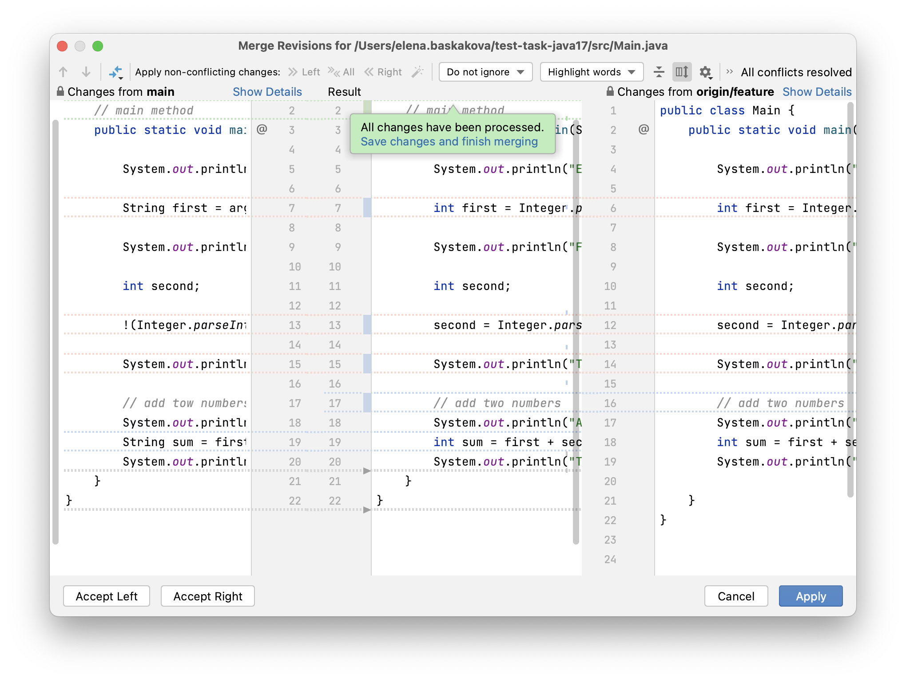

# Tutorial: Resolve merge conflicts using IntelliJ IDEA

In this tutorial, you will learn how to resolve merge conflicts using IntelliJ IDEA.

We recommend that you use the [latest version of IntelliJ IDEA](https://www.jetbrains.com/idea/download/) and [Java Development Kit](https://en.wikipedia.org/wiki/Java_Development_Kit) 17. Refer to  [Java Development Kit (JDK)](https://www.jetbrains.com/help/idea/sdk.html#jdk) for information on how to configure it in IntelliJ IDEA.

## Clone the project

1. Launch IntelliJ IDEA.
2. Clone the [sample project](https://github.com/elenaspb2019/test-task-java17) from GitHub as described in [Check out a project (clone)](https://www.jetbrains.com/help/idea/manage-projects-hosted-on-github.html).

   This project will open automatically when the cloning is complete.
   
   You can also open the project manually: select **File | Open** from the main menu and find the downloaded project in the dialog that opens.

## Merge the feature branch into the main branch

In the downloaded project, we have two branches: the default main branch and the feature branch. We need to merge our feature branch into the main one.

1. From the main menu, select **Git | Merge.**
2. Select origin/feature and click **Merge**.

   IntelliJ IDEA opens the **Conflicts** dialog automatically when a conflict is detected by Git. Files with no conflicts are merged automatically.

   

3. Select the .gitgnore file and click **Accept Yours** to choose changes from the main branch, as we are sure the changes from the main branch are correct.
4. Select the Main.java file and click **Merge** to resolve conflicts manually.

   Once the **Merge** window opens, you can start reviewing the changes. The conflicts are highlighted in red, while the other changes are in different colors.

   

## Apply the non-conflicting changes

Non-conflicting changes are usually easier to review than conflicting ones. Let’s start with the non-conflicting changes. 

You need to accept  or ignore  every change from the current branch (main) on the left and the remote one (feature) on the right and also check the resulting code in the central pane.

1. Accept the right-side changes to line 16 by clicking  or by pressing ⌃ ⌘ ←.

   

2. In line 19, we need to leave the int type. Ignore changes from the left side to line 19 by clicking . 

   

3. The rest of the non-conflicting changes seem valid. Accept them by clicking  **All** on the toolbar.

## Resolve the conflicts

Once all the non-conflicting changes are applied, we can proceed to resolve the conflicts.

1. For some conflicts, where different parts of the line were changed, IntelliJ IDEA provides automatic resolution. Just click the **Resolve Simple Conflicts**  button on line 6.

   

    Even if the conflict was resolved, the code is not necessarily correct. This has happened in our case. Note that the error appeared in the highlighted text in the central pane.

   

2. The central pane is a fully-functional editor, so we can make changes to the resulting code directly in this dialog. Change _String first_ into _int first_, then the incompatibility type error will disappear.

   

3. To fix the next problem in line 12, click  or press ⌃ ⌘ ←. Decline changes on the left side in line 13 by pressing . Alternatively, you can accept changes from one side and ignore them from the other side by hovering the mouse over  and pressing Ctrl+Click.

   

4. Let’s fix the last problem another way. There is a minor problem with the article. Click on the line on the left side and wait until the context menu appears. Select **Accept** from the menu or press ⌃ ⌘ →, then ignore the changes from the right side by clicking 

   

After all the changes are approved, you will see the **All changes have been processed** popup. Review the merge results in the central pane, then click **Save changes and finish merging** or **Apply**. 

## Check your code for errors and run it

When the merge is finished, [check your code for errors](http://jetbrains.com/help/idea/file-and-project-analysis.html) and[ try to run your code](https://www.jetbrains.com/help/idea/running-applications.html). After that, you can commit and push your changes to the remote project.
